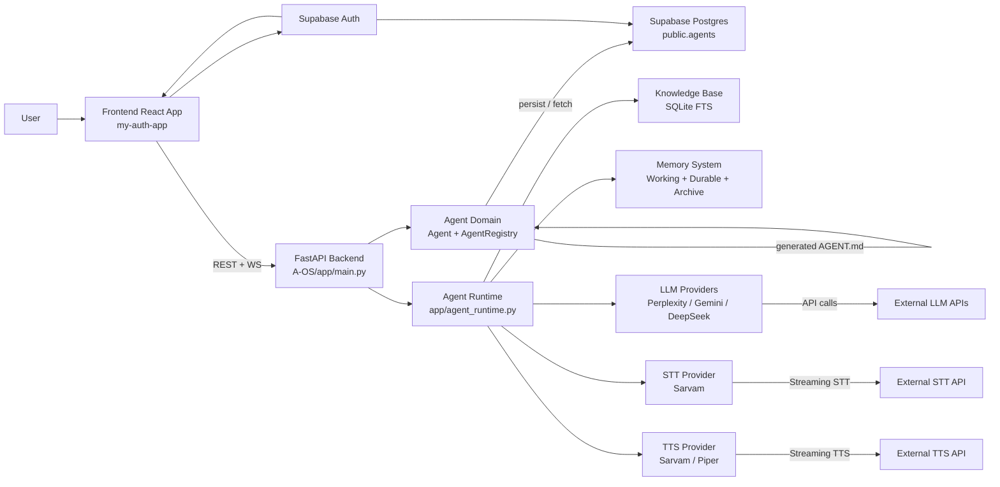

# PROJECT OVERVIEW

## 1. Executive Summary

This repository contains an AI agent platform focused on configurable voice and chat agents. The system is organized as two connected parts: a Python FastAPI backend in `A-OS` and a React/Vite frontend in `my-auth-app`. The backend manages agent definitions, runtime orchestration, LLM/STT/TTS integration, memory, and knowledge retrieval. The frontend is a user-facing dashboard for authenticating, creating agents, configuring behavior, and launching conversations.

The platform allows a user to define an agent with a name, purpose, personality, tone, conversation style, knowledge sources, tools, provider selections, and memory policy. That definition is then rendered into runtime instructions and used by the agent runtime to handle either voice interactions or text chat. The primary interaction model is conversational: live microphone audio passes through speech-to-text, the resulting transcript is processed by an LLM with context from working memory and relevant knowledge, and the response is spoken back through TTS or returned as chat text.

The role of AI agents is central. Each agent is not just a prompt; it is a structured configuration object with behavior rules, context, durable settings, and a persistence boundary. The application is designed to support agent configuration for user-owned agents, runtime behavior shaped by `agent_definition`, and a knowledge-grounded, voice-first user experience.

## 2. Problem Statement

The project addresses the need for a customizable conversational AI system that is not limited to a single fixed assistant persona. In practice, the repository is aimed at teams or users who want to create specialized agents for different use cases with distinct personality, constraints, escalation rules, and knowledge sources. A generic chatbot is not sufficient when the system needs to behave like a support agent, a coach, a sales assistant, or a domain-specialized assistant with consistent boundaries.

The repository reflects that requirement through a configurable agent model and runtime pipeline. Agents are defined by fields such as `agentType`, `purpose`, `goals`, `personality`, `tone`, `conversationStyle`, `allowedTopics`, `restrictedTopics`, `escalationRules`, and `humanHandoffConditions`. These settings are not decorative; they are used to generate runtime instructions and influence behavior.

Voice/chat interaction matters because the platform is designed for real-time conversational use, not only static prompts. Memory and knowledge grounding matter because a useful conversational agent must retain relevant user-specific facts and answer from grounded context instead of improvising. This repository provides both a working-memory layer and a longer-term memory policy, plus a retrieval layer for document, URL, and FAQ knowledge sources.

## 3. Project Goals and Objectives

From the implementation, the major goals are:

- Configurable AI agents with persistence and user ownership.
- Human-like conversational behavior that can be shaped by personality, tone, and conversation style.
- Voice-first interaction using microphone input, streaming STT, and TTS playback.
- Chat interaction as a lower-latency text path alongside the voice pipeline.
- Knowledge-grounded replies using injected retrieval context.
- User-specific memory that can be loaded for the current session and optionally persisted across turns.
- Durable agent definitions stored in a backend store while projecting a generated `AGENT.md` layout for runtime use.
- Authentication and ownership boundaries around agent access.
- Multi-provider AI support through a provider registry and factory abstraction.

These goals are present in code and configuration, but the project is not uniformly complete across all dimensions. The repository shows an active architecture and several implementation points, while also exposing configuration and runtime dependencies that are still essential to operation.

## 4. Target Audience

The intended primary audience is a user or operator who wants to create and use specialized AI agents with a simple web dashboard. In the current frontend, the user signs in with Supabase Auth, creates agents, edits their properties, and then launches or tests them. The agent lifecycle is user-scoped: agents are retrieved and stored relative to the authenticated user.

The secondary audience is the developer/operator who must configure providers, run the backend, maintain the runtime, and understand the contracts between frontend and backend. That includes setting environment variables, debugging provider configuration, and verifying Supabase and AI provider connectivity.

The frontend is clearly designed for end-user configuration of agent settings, not only for developer-side administration. It presents fields for personality, provider selection, knowledge sources, memory, topics, and voice settings.

## 5. Key Features and Capabilities

### Agent Management

The backend supports creating, listing, loading, updating, and deleting agents through REST routes in `app/main.py`. Agents are represented by `app/agents/model.py` as a dataclass with fields such as `name`, `goal`, `description`, `capabilities`, `knowledge_sources`, `channels`, `configuration`, `status`, `version`, `owner_id`, and timestamps.

The repository layer is abstracted by `app/agents/repository.py` and implemented by a Supabase-backed repository in `app/agents/supabase_repository.py`. The `AgentRegistry` in `app/agents/registry.py` is the main orchestration boundary: it saves agents, renders a generated `AGENT.md` definition, and acts as a repository-aware domain service for agent persistence and retrieval.

The application also includes a local file-based fallback in `AgentRegistry` by writing `data/agents/<id>.json` and `data/agents/<id>.AGENT.md`. In the current backend, `AgentRegistry` is instantiated with the Supabase repository by default, which means the durable store is meant to be Supabase Postgres, while the local files are also generated as a compatibility artifact.

### Agent Behavior

The runtime configuration combines agent metadata with a generated `agent_definition` string. `runtime_configuration()` in `app/main.py` assembles a definition from the agent's configuration plus generated instructions derived from fields like `agentType`, `purpose`, `personality`, `tone`, `conversationStyle`, `allowedTopics`, `restrictedTopics`, `escalationRules`, and `humanHandoffConditions`.

This is then appended to the system prompt used by the LLM. The repository also includes a dedicated prompt generation route (`/prompt-generator`) that calls an LLM to synthesize a new or improved `systemInstructions` payload from the selected agent settings. This is a structured prompt-generation layer rather than a separate agent-rule engine.

### Voice

The voice path is the most mature runtime pathway in the codebase. The system architecture is:

- Browser microphone capture in the frontend
- FastAPI WebSocket at `/ws` in `app/main.py`
- `AudioEngine` in `app/audio/engine.py` for playback and capture scheduling
- `STTService` in `app/stt/service.py` using the Sarvam streaming STT API
- Agent runtime orchestration in `app/agent_runtime.py`
- LLM response generation via `app/llm/service.py` and the provider abstraction
- TTS via `app/tts/service.py` or the Sarvam streaming TTS service
- Audio playback back to the browser or local speaker driver

The voice pipeline uses a streaming approach with speech detection and interruption handling. Barge-in is implemented via the STT callback path: when the user begins speaking while the assistant is active, the runtime interrupts the assistant and stops TTS playback. This is a clear architectural signal that low latency is an explicit requirement.

### Chat

The text chat path is simpler than voice and is implemented via `POST /chat` in `app/main.py`. It loads the agent, resolves the configured LLM provider, retrieves relevant knowledge context, and then streams tokens from the selected provider back as a response. Unlike the voice runtime, the chat route does not create a persistent live session or manage microphone input.

### Memory

The memory architecture is implemented in `app/memory/` and has several layers:

- `WorkingMemory` stores the active conversation context in memory for the current session.
- `SessionManager` creates and tracks the current session_id, agent_id, and user_id.
- `ConversationArchive` stores completed sessions to JSON files under `app/memory/storage/conversations`.
- `LongTermMemory` persists durable user/agent memory to JSON under `app/memory/storage/durable_memory.json`.
- `MemoryService` coordinates working memory, session scoping, and long-term memory activation.

The key behavior is policy-driven. Long-term memory is only enabled when configuration includes `memoryType == "long-term"`, `persistentMemory == True`, and `userMemory == True`. `get_relevant_memory_context()` retrieves a small set of relevant memories using token overlap ranking and injects them into the LLM context. This is a compact retrieval layer for user facts, not a full memory database.

Current limitations are evident from the implementation: the memory code is designed to be JSON-file-based, not a database-backed service; it is scoped to agent+user pairs; and some status transitions (`superseded`, `forgotten`) and retention logic exist but are not a full production memory platform. The repository includes tests that validate that selection is capped and only active memories are used, but it does not show a mature, externally managed memory system.

### Knowledge Base

The knowledge layer is in `app/knowledge/service.py`. It stores agent knowledge sources in SQLite at `data/knowledge.db` and creates:

- `knowledge_sources` records for each source
- `knowledge_chunks` for chunked source text
- an FTS virtual table using SQLite FTS5 for query searching

Supported source types are inferred in the service and include `document`, `url`, and `faq`-style content. `reindex_agent()` chunks and indexes sources, while `retrieve()` runs a text search with BM25 ranking and `render_context_for_query()` injects the top results as grounding context into the prompt.

This is a lightweight local knowledge base, not a managed vector database. It deliberately uses a simple chunking and retrieval flow for conversational grounding. It is better understood as a local KB layer tied to an agent than as a general-purpose document search system.

### Authentication

The frontend clearly uses Supabase Auth for sign-in and sign-up (`my-auth-app/src/lib/supabase.ts`, `LoginForm.tsx`, `RegisterForm.tsx`, and the dashboard app). The backend is not full JWT-authenticated on its own; instead, routes like `/agents`, `/start`, etc. accept `user_id` as a query parameter and enforce ownership by comparing it to `agent.owner_id`. In other words, the current repository treats Supabase Auth as the identity layer for the web app and uses `user_id` as the per-request user identity in the backend logic.

This means authentication is a real part of the system, but the backend is currently trusting the front-end-provided user identity instead of verifying Supabase JWT tokens at the API boundary. That is an important architectural caveat.

### Prompt Generator

The prompt-generation route in `app/main.py` uses the configured LLM provider to generate a blended prompt specification from fields like agent type, purpose, system instructions, tone, style, goals, and allowed/restricted topics. The generated result is a `PromptGeneratorResponse` object with fields for `purpose`, `systemInstructions`, `goals`, `allowedTopics`, `restrictedTopics`, `escalationRules`, `humanHandoffConditions`, and `suggestions`.

These generated values are not the canonical persisted agent configuration; they are part of the runtime-facing config. The generated prompt is not automatically written back to the database on its own in this route, and the `AgentRegistry.render_definition()` method is the current place where the agent definition is materialized for runtime use.

### Provider Layer

The provider abstraction is implemented through:

- `app/providers/registry.py`
- `app/providers/factory.py`
- `app/providers/*/base.py`
- concrete provider classes for STT, LLM, and TTS

The backend registers providers from `app/providers/__init__.py`. Current concrete providers include:

- STT: Sarvam streaming STT
- LLM: DeepSeek, Gemini, Perplexity
- TTS: Piper, Sarvam streaming TTS

The provider layer abstracts the runtime from provider-specific SDK details and is the central place for provider selection. It is not a fully dynamic plugin system with remote configuration; it is a built-in registry and factory-based selection layer.

## 6. Functional Scope

### In Scope / Implemented

- Agent CRUD API with user-scoped ownership
- Agent persistence in Supabase with a validation schema check at startup
- Local fallback generation of `*.json` and `*.AGENT.md` agent files
- Runtime configuration assembly from agent policy and settings
- Voice runtime with microphone audio, STT, LLM generation, and TTS playback
- WebSocket state and audio streaming support
- Switchable LLM provider selection
- Switchable TTS/STT provider selection via provider registry
- Local knowledge base with SQLite FTS indexing and retrieval
- Memory service with working memory, session lifecycle management, retention logic, and retrieval of relevant durable memory
- Supabase Auth-based frontend sign-in and registration
- Agent creation/edit/list UI in the React dashboard
- Prompt generation API route that synthesizes agent instructions from user input

### Partially Implemented

- The backend security boundary is partially implemented: it accepts `user_id` from the client, but there is no explicit server-side JWT validation layer in the API. Ownership is enforced procedurally rather than by verified auth middleware.
- The runtime uses a local file JSON store and a Supabase repository, but the canonical persistence contract and runtime operational assumptions are not fully isolated or normalized across all branches of the app.
- `AGENT.md` is generated for runtime use, but it is not the canonical source of truth for durable agent storage.
- Memory retention and long-term learning are present but still policy-gated and lightweight; they are not a complete enterprise memory system.
- The frontend and backend exhibit a defined API contract, but not a formal OpenAPI schema versioning or formal contract enforcement beyond Python models and runtime checks.
- Some provider and runtime configuration paths exist but are highly environment-dependent, especially SARVAM, Perplexity, Gemini, DeepSeek, and Supabase access.

### Out of Scope / Not Implemented

- No evidence of a full distributed job queue or async worker infrastructure for background agent processing.
- No full RBAC/organization-level multi-tenant access policy beyond user-owned agent filtering.
- No evidence of dedicated workflow orchestration for multi-step tool use beyond the knowledge and prompt-generation patterns already present.
- No evidence of fully formalized API contracts for external consumers beyond the internal frontend/backend integration.
- No evidence of a built-in docs or admin portal for operational monitoring beyond the runtime printing and debug output.

## 7. Non-Functional Requirements

This project has several clear architectural requirements and constraints, though not all are equally mature in current implementation.

- Intended requirement: low-latency voice interaction for real-time conversation.
- Intended requirement: browser/backend separation with a clear FastAPI + React API boundary.
- Current property: the backend is built around async I/O and streaming interactions for TTS/STT/LLM path execution.
- Intended requirement: user/agent data isolation through `owner_id` and `user_id` scoping.
- Current property: the backend enforces user ownership based on the supplied `user_id`, but does not fully verify identity at the API layer.
- Intended requirement: server-side secret handling; all provider SDK keys should remain on the backend and not be embedded in client code.
- Current property: the frontend only references Supabase env vars; the backend reads provider and Supabase credentials from environment variables.
- Intended requirement: persistent agent definitions and state.
- Current property: agent persistence is supported via Supabase and local fallback generation.
- Intended requirement: memory and knowledge retrieval should stay lightweight enough for conversational use.
- Current property: relevant-memory selection and KB retrieval are intentionally capped to a small number of results.
- Intended requirement: maintainability through provider abstractions and runtime separation.
- Current property: the registry and factory patterns support provider swapping without tight vendor coupling.

## 8. High-Level Architecture

The project is best thought of as a layered system:

```text
Frontend
  ↓
FastAPI API / WebSocket layer
  ↓
Agent Runtime / Application Services
  ↓
LLM / STT / TTS / Memory / Knowledge
  ↓
External Services + Persistent Storage
```

The frontend in `my-auth-app` is the user-facing config and interaction layer. It signs in to Supabase Auth and calls the backend API for agent CRUD, provider discovery, prompt generation, and runtime start/chat actions. It also opens a WebSocket to `/ws` for state and audio updates.

The backend in `A-OS/app/main.py` is the orchestration layer. It creates an `AgentRegistry`, loads providers, validates Supabase schema, serves REST routes, and manages the runtime lifecycle. The `AgentOSRuntime` in `app/agent_runtime.py` is the most important runtime service: it coordinates audio input, model generation, speech output, and interruptions.

The domain layer is centered on `agent` objects and their configuration. The `AgentRegistry` sits between the domain model and persistence. It is not the same as the durable database contract: in this codebase, `AGENT.md` files are generated runtime projections, while the canonical persisted record is the row in Supabase or the JSON fallback.

The provider layer sits beneath the runtime and encapsulates STT, LLM, and TTS providers. These are selected by ID and configured by agent configuration. The memory and knowledge services are applied at runtime to augment prompts and ground responses. The runtime does not treat memory or KB as independent services in a microservice sense; they are app-level services embedded in the Python backend.

This architecture deliberately separates concerns:

- frontend vs backend: UI logic and API interaction are separate from runtime orchestration
- API vs runtime: HTTP and WebSocket routes are not the same as the conversation runtime
- domain vs persistence: `Agent` is a domain object; repository access is an adapter layer
- registry vs Supabase repository: `AgentRegistry` manages logic and rendering, while the repository persists data
- runtime vs providers: the runtime orchestrates providers, but the providers hide SDK details
- memory vs persistence: working memory is ephemeral, long-term memory is durable, and agent data is stored separately
- knowledge retrieval vs generation: knowledge is retrieved and injected as context before response generation

## 9. System Context / Architecture Diagram



This is intentionally a high-level diagram. It shows the key relationships without exposing secrets or provider details beyond the layer names.

## 10. Major External Dependencies

| Dependency | Purpose | Where Used | Required at Runtime? |
| --- | --- | --- | --- |
| Supabase | Auth and durable agent storage | `my-auth-app` frontend, `app/agents/supabase_repository.py`, `app/main.py` | Yes, for the durable agent store and auth flow |
| Supabase Postgres (`public.agents`) | Canonical durable Agent table for persisted records | `SupabaseAgentRepository` and the schema validation startup check | Yes, for current production-like persistence |
| Sarvam AI | Streaming STT and streaming TTS | `app/stt/service.py`, `app/providers/stt/sarvam/provider.py`, `app/providers/tts/sarvam/service.py` | Yes, for the current STT/TTS path |
| Perplexity | LLM provider | `app/providers/llm/perplexity/provider.py`, `app/llm/service.py` | Conditional, but default in runtime |
| DeepSeek | LLM provider | `app/providers/llm/deepseek/provider.py` | Conditional |
| Gemini | LLM provider | `app/providers/llm/gemini/provider.py` | Conditional |
| Piper | Local TTS engine | `app/tts/service.py`, `app/providers/tts/piper/provider.py` | Conditional; local binary/tooling required |
| SQLite/FTS5 | Local knowledge base storage and search | `app/knowledge/service.py` | Yes, for the current knowledge base implementation |
| WebSocket transport | Browser-to-backend live connection for state and audio streaming | `app/main.py`, `app/websocket_manager.py` | Yes for voice runtime and UI state sync |

This table reflects only dependencies that are clearly present in the repository and used architecturally, not generic Python package dependencies.

## 11. Project Status and Current State

### Working

- Agent creation, editing, listing, and deletion flow exists end-to-end in the backend and frontend.
- Frontend authentication with Supabase is implemented.
- Agent persistence and schema validation are implemented for the Supabase-backed repository.
- Knowledge retrieval and indexing are implemented and tested through the repository code.
- Voice runtime orchestration exists with interruption handling, STT feedback, LLM response generation, and TTS playback.
- The provider abstraction is implemented and usable.
- Memory retrieval logic is implemented and covered by tests in the repository.

### Partially Working

- The backend identity model is partially enforced and relies on a `user_id` passed from the frontend rather than explicit JWT validation.
- The runtime is highly dependent on environment configuration and provider access.
- `AGENT.md` generation is implemented as a derived artifact, not as the canonical persistence model.
- Memory persistence is lightweight and file-backed; it is not a production-grade long-term memory service.
- The UI is feature-rich but appears to be a dashboard prototype or internal tool rather than a broadly hardened application shell.

### Configuration-dependent

- Supabase credentials and table schema are required for the durable agent store.
- The selected LLM provider requires API keys and provider-specific configuration.
- Sarvam AI credentials are required for current STT/TTS functionality.
- Piper TTS requires the local executable and model path or a correctly configured environment.

### Needs Verification

- Real end-to-end voice behavior across the full browser + backend + provider stack cannot be assumed from static code alone.
- The repository includes tests for API contracts and memory behavior, but not a full end-to-end scripted verification of runtime integration.
- External cloud provider behavior and response fidelity remain environment and key dependent.

### Planned

No roadmap-style feature list is clearly supported here. Any future expansion should be treated as a plan rather than an implemented property unless the repository clearly demonstrates it.

## 12. Important Assumptions and Constraints

This section captures the assumptions that a developer should understand before making changes.

- Supabase Auth is the identity mechanism used in the frontend and is the probable source of the user identity that gets passed into backend routes.
- Supabase Postgres is the current canonical durable store for persisted Agent rows, while local `data/agents/*.json` and `*.AGENT.md` files are generated artifacts and local fallback behavior.
- `AgentRegistry` is the persistence boundary and the main domain service for agent retrieval, listing, and rendering.
- `AGENT.md` is a generated compatibility/runtime projection rather than the canonical store of agent definitions.
- Frontend and backend APIs already share a contract around `user_id`, agent payloads, and route names such as `/agents`, `/chat`, `/start`, `/providers`, and `/prompt-generator`.
- Provider credentials and secrets must stay on the backend side; they should not be embedded or exposed via the frontend.
- Voice response latency is an explicit architectural concern, and the runtime is designed around low-latency barge-in handling and streaming generation.
- Knowledge retrieval should remain lightweight and conversation-friendly, which is why retrieved results are intentionally capped and injected in compact form.
- Memory is scoped by agent and user and is not a globally shared memory store.
- The backend route layer currently uses `user_id` supplied by the client; this is an implementation fact and a security caveat.

## 13. Developer Orientation

When making common changes, this is the fastest path through the codebase:

- Agent model and configuration: `app/agents/model.py`, `app/agents/registry.py`, `app/main.py`
- Agent persistence: `app/agents/repository.py`, `app/agents/supabase_repository.py`
- Agent API contract: `app/main.py` routes for `/agents`, `/start`, `/chat`, `/providers`, `/prompt-generator`
- Voice runtime: `app/agent_runtime.py`, `app/audio/engine.py`, `app/stt/service.py`, `app/tts/service.py`
- LLM provider layer: `app/providers/`, `app/providers/factory.py`, `app/llm/service.py`
- Memory: `app/memory/service.py`, `app/memory/working_memory.py`, `app/memory/long_term.py`, `app/memory/session.py`
- Knowledge Base: `app/knowledge/service.py`
- Authentication: `my-auth-app/src/App.tsx`, `my-auth-app/src/lib/supabase.ts`, `my-auth-app/src/components/*`
- Frontend agent UI: `my-auth-app/src/app/App.tsx`

A new developer should start by reading the model, registry, runtime, and main API file together. Those files explain the project’s central architecture and show how the logic flows from the UI to the agent definition and runtime pipeline.

---

This document is intentionally a high-level overview. It is meant to help a developer orient quickly without reading all source files, while still distinguishing between what is clearly implemented, what is partial, and what remains configuration-dependent or unverified.
