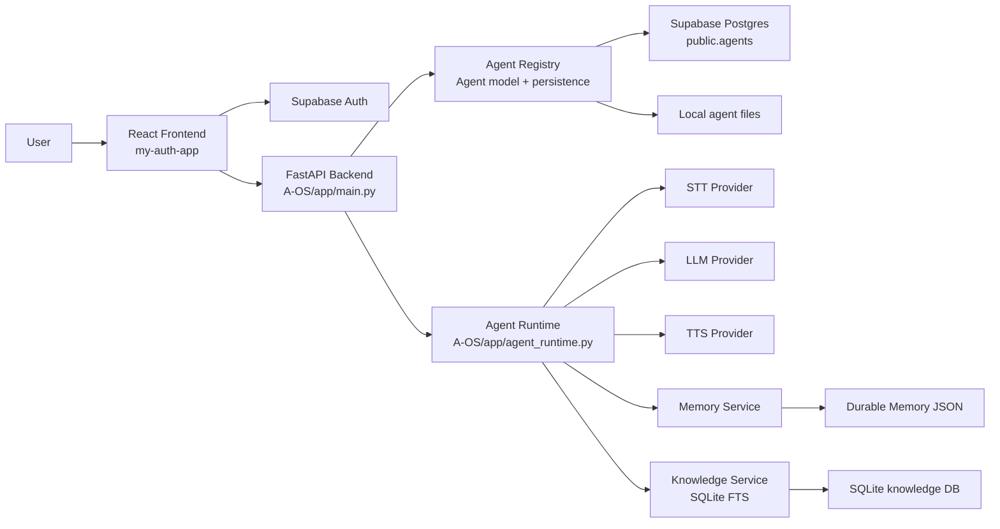

# AgentOS

A configurable voice and chat AI agent platform built around a Python FastAPI backend and a React/Vite frontend.

## Overview

AgentOS is a repository for creating and managing user-owned AI agents that can participate in chat and voice conversations. The system combines agent configuration, runtime orchestration, knowledge grounding, and memory to produce a conversational assistant that is shaped by the agent definition rather than a single fixed prompt.

The project currently has two major parts:

- the backend in `A-OS`, which serves the API, runs the runtime orchestration, and connects to LLM/STT/TTS providers
- the frontend in `my-auth-app`, which provides a browser-based dashboard for authentication, agent management, and interaction

The current implementation is a working local prototype and integration layer, not a fully hardened production system.

## What It Does

The repository currently supports:

- configurable AI agents with a persisted agent model
- agent creation, listing, retrieval, update, and deletion
- user-scoped ownership for agents
- live voice interaction with microphone input and speech-to-text
- model-driven responses from configured LLM providers
- text-to-speech playback for spoken replies
- chat responses grounded with knowledge context
- local knowledge indexing and retrieval for agent-specific sources
- working-memory and durable-memory behavior for sessions and longer-lived user facts
- Supabase authentication in the frontend
- persistence of agent records in Supabase Postgres
- provider abstraction for STT, LLM, and TTS integration

## Architecture



The backend is the orchestration layer. The FastAPI app exposes REST and WebSocket endpoints, loads provider implementations, and coordinates runtime behavior. The agent layer persists user-owned agent definitions and project runtime configuration. Memory and knowledge services then augment the conversation context before LLM generation.

[Read the full Technical Design →](TECHNICAL_DESIGN.md)

## Key Features

### Agent System

- create, load, update, and delete user-owned agents
- persist agent definitions through a Supabase repository
- generate runtime `AGENT.md`-style definitions from the agent model
- validate schema at startup and enforce owner-scoped access

### Voice

- microphone-driven voice interaction
- STT processing through the configured provider
- runtime interruption and barge-in handling
- TTS playback using a configured provider
- WebSocket-backed browser audio and state streaming

### Conversation

- text chat routes for agent responses
- runtime context assembly from working memory, durable memory, and knowledge retrieval
- provider-managed response generation through a common LLM abstraction

### Memory

- working memory for active conversational state
- durable memory persistence for user/agent facts
- context selection from relevant memory matches
- retention and learning policy driven by configuration

### Knowledge

- local SQLite knowledge store
- indexing of agent knowledge bases
- FTS-based retrieval for grounded context
- injection of relevant knowledge chunks into the LLM prompt

### Authentication

- Supabase Auth in the frontend
- user-scoped agent access based on `user_id` and `owner_id`
- database ACL enforcement via Supabase RLS in the migration SQL

### Provider System

- provider registry and factory for LLM, STT, and TTS selection
- support for multiple provider families in the current codebase
- runtime selection by configuration rather than hard-coded behavior

## Technology Stack

| Layer | Technology | Purpose |
| --- | --- | --- |
| Frontend | React + Vite + TypeScript | Browser UI and agent dashboard |
| Backend | Python + FastAPI | API, runtime orchestration, agent services |
| Database | Supabase Postgres | Persistent agent storage |
| Search / retrieval | SQLite + FTS5 | Local knowledge indexing and retrieval |
| Auth | Supabase Auth | Browser sign-in and session handling |
| Voice | Sarvam STT / TTS, Piper TTS | Speech processing and playback |
| AI | Perplexity, DeepSeek, Gemini | LLM integration |
| Runtime | Python async services | Turn orchestration and session behavior |

Verified versions in the repository include:

- FastAPI 0.139.2
- React 19.0.0
- Vite 6.0.0
- TypeScript 5.7.0
- Python dependencies in `A-OS/requirements.txt`

## Project Structure

```text
A-OS/
├── app/
│   ├── agents/
│   ├── audio/
│   ├── conversation/
│   ├── core/
│   ├── debug/
│   ├── knowledge/
│   ├── llm/
│   ├── memory/
│   ├── providers/
│   ├── runtime/
│   ├── security/
│   ├── stt/
│   ├── tts/
│   ├── vad/
│   ├── agent_runtime.py
│   ├── main.py
│   └── websocket_manager.py
├── data/
├── supabase/
│   └── migrations/
├── tests/
├── en_US-lessac-medium.onnx
├── en_US-lessac-medium.onnx.json
├── jarvis_runtime.py
├── main.py
├── PROJECT_OVERVIEW.md
├── SETUP.md
├── TECHNICAL_DESIGN.md
├── ROADMAP.md
├── requirements.txt
├── .gitignore
└── README.md

my-auth-app/
├── src/
├── public/
├── index.html
├── package.json
├── tsconfig.json
├── vite.config.ts
├── README.md
└── ...
```

Important folders:

- `A-OS/app/` — backend runtime and application logic
- `A-OS/supabase/migrations/` — Supabase schema and ownership rules
- `A-OS/tests/` — backend validation and contract checks
- `A-OS/data/` — runtime local data for knowledge and generated state
- `my-auth-app/src/` — frontend React application

## Quick Start

The frontend (`my-auth-app`) and backend (`A-OS`) are separate repositories and are started separately. There is no root-level Compose file joining them. For Docker, each repository provides LOCAL, DEV, and PROD Compose configurations; run commands from that repository's directory.

### Backend LOCAL

The existing manual LOCAL workflow remains available:

```bash
python -m uvicorn app.main:app --host 0.0.0.0 --port 8000 --reload
```

The backend Docker workflows use:

- LOCAL: `docker-compose.yaml` (bind mount and Uvicorn reload)
- DEV: `docker-compose.dev.yaml` (immutable image, no reload)
- PROD: `docker-compose.prod.yaml` (immutable image, one Uvicorn worker)

For backend Docker commands, environment configuration, ports, and persistent volumes, see [SETUP.md](SETUP.md).

The frontend also has separate LOCAL, DEV, and PROD Compose files and commands in the `my-auth-app` repository's `README.md`.

### Frontend LOCAL

The existing manual LOCAL workflow remains available from the frontend repository:

```bash
npm install
npm run dev
```

The Docker LOCAL, DEV, and PROD workflows are documented in the frontend repository. No checked-in root-level orchestration joins the frontend and backend.

For the complete installation instructions, environment setup, and troubleshooting, see [SETUP.md](SETUP.md).

## Environment Configuration

This project separates frontend and backend configuration cleanly:

- the frontend uses browser-facing environment settings for Supabase and UI integration
- the backend uses server-side environment variables for provider credentials and database access

The repository does not include a single `.env.example` file. Environment variables are expected to be configured as required by the local environment and provider setup.

See [SETUP.md](SETUP.md) for the full environment configuration guidance.

## Authentication

The frontend is built around Supabase Auth. Authentication is handled in the browser and the session token is used to identify the current user. The backend routes rely on a `user_id` value and compare it with `owner_id` to enforce user-owned access.

This means the current implementation clearly uses Supabase Auth and user-scoped access, but the backend does not appear to validate API bearer tokens or session cookies directly at the route layer.

`Not verified from the repository.`: claims that the FastAPI app validates a server-side JWT for every protected endpoint.

## Database

The repository uses more than one persistence layer:

- Supabase Postgres for agent persistence in `public.agents`
- SQLite with FTS5 for local knowledge indexing and retrieval
- JSON-based runtime memory and conversation archive files

The canonical agent contract is enforced by migration SQL and by runtime validation in the backend repository layer.

See [TECHNICAL_DESIGN.md](TECHNICAL_DESIGN.md) for the detailed schema and data model description.

## Documentation

| Document | Purpose |
| --- | --- |
| [Project Overview](PROJECT_OVERVIEW.md) | What the project is, the problem it addresses, its capabilities, and high-level architecture |
| [Setup Guide](SETUP.md) | Complete local setup, installation, environment configuration, and troubleshooting |
| [Technical Design](TECHNICAL_DESIGN.md) | Detailed implementation architecture, models, routes, providers, runtime flow, security, and integrations |
| [Roadmap](ROADMAP.md) | Current status, planned work, and known gaps |

Start with [PROJECT_OVERVIEW.md](PROJECT_OVERVIEW.md) if you are new to the system. Use [SETUP.md](SETUP.md) to run it locally, [TECHNICAL_DESIGN.md](TECHNICAL_DESIGN.md) to understand implementation details, and [ROADMAP.md](ROADMAP.md) to understand future work.

## Current Status

The repository currently contains a working architecture for:

- agent lifecycle management
- chat and voice runtime orchestration
- provider abstraction
- knowledge retrieval
- memory features
- frontend auth and agent dashboard

It is still dependent on external services and runtime configuration, and several boundaries remain partially implemented or environment-sensitive.

The current implementation is best described as a functional local prototype with real operational components, not a complete production-grade platform.

See [ROADMAP.md](ROADMAP.md) for the current status and future work.

## Development

Backend work lives under `A-OS/app/` and is centered on FastAPI route handlers, provider configuration, runtime orchestration, and data services. Frontend work lives under `my-auth-app/src/` and is centered on authentication, agent management, and browser interaction.

The most important architectural entry points are:

- `A-OS/app/main.py` — API routing and runtime wiring
- `A-OS/app/agent_runtime.py` — live conversation orchestration
- `A-OS/app/agents/model.py` — canonical agent domain model
- `A-OS/app/agents/supabase_repository.py` — Supabase persistence adapter
- `A-OS/app/knowledge/service.py` — local knowledge retrieval
- `A-OS/app/memory/service.py` — session and durable memory behavior
- `my-auth-app/src/app/App.tsx` — the main frontend dashboard and workflow

The backend test suite lives in `A-OS/tests/` and is the quickest place to understand the repository’s contract assumptions.

## Contributing

Contribution guidelines are not formally documented in the repository.

## Troubleshooting

The most common issues in this project are usually tied to:

- missing or incorrect environment variables
- Supabase auth or Postgres configuration
- schema drift in `public.agents`
- missing provider credentials or external API access
- local runtime dependencies for audio and TTS

For the complete troubleshooting guide, see [SETUP.md](SETUP.md).

## Roadmap

The project is moving toward a more robust, configurable AI agent platform that preserves the current runtime architecture while tightening ownership boundaries, runtime configuration, and deployment readiness.

The current roadmap is documented in [ROADMAP.md](ROADMAP.md).

## License

No license file was found in the repository.
