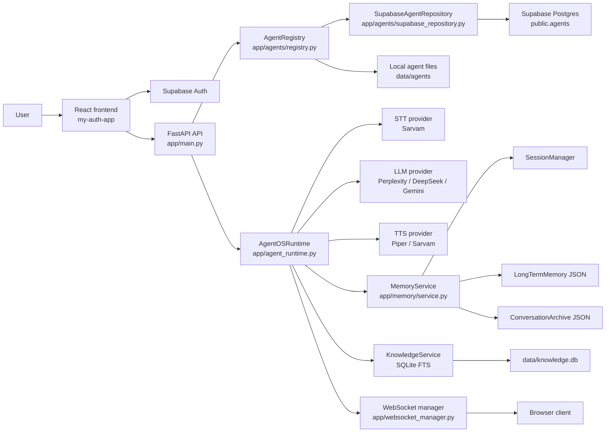
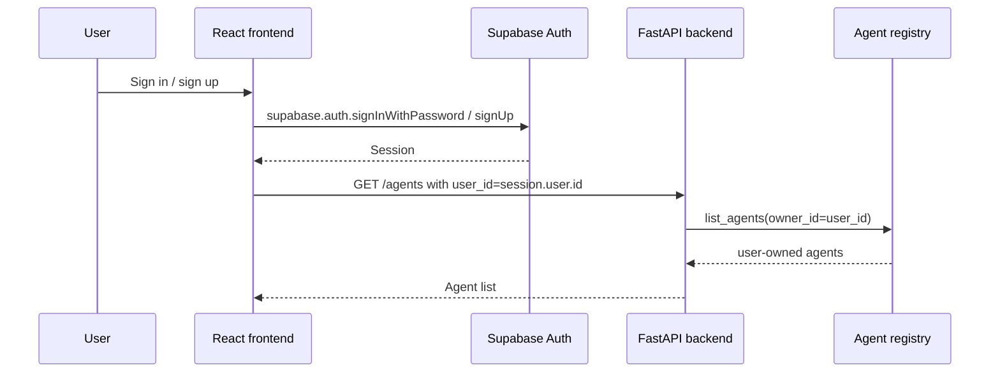
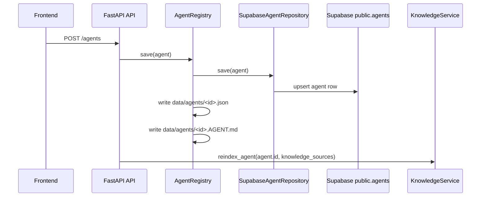
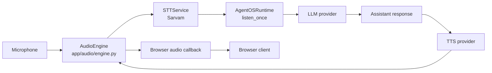
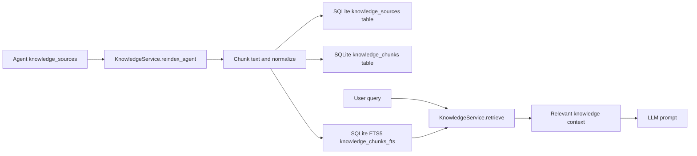
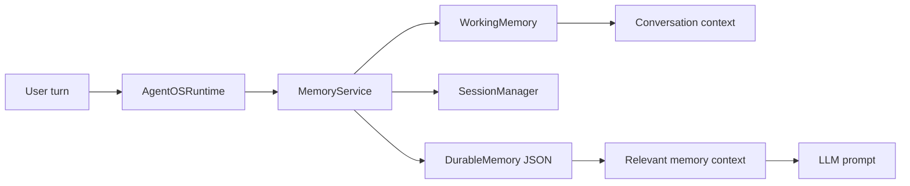

# TECHNICAL DESIGN

## 1. System Architecture

This repository currently contains a Python backend and a React frontend that work together as a user-configurable voice/chat agent system.

### Current implementation

- The backend is in `A-OS` and is served by FastAPI from `app/main.py`.
- The frontend is in `my-auth-app` and uses Vite + React.
- Agent persistence is primarily backed by Supabase Postgres via `app/agents/supabase_repository.py`.
- A local file-based fallback is also created by `AgentRegistry` in `app/agents/registry.py`.
- Voice interaction runs through a live runtime in `app/agent_runtime.py` and uses STT, LLM, and TTS providers.
- Knowledge retrieval uses a local SQLite database in `data/knowledge.db` created by `app/knowledge/service.py`.
- Durable memory is stored in JSON files under `app/memory/storage/`.

### High-level system architecture



### Important scope boundaries

- `agent_registry` is the domain-level orchestration boundary.
- `SupabaseAgentRepository` is the persistence adapter for `public.agents`.
- `KnowledgeService` is a separate local retrieval subsystem from agent persistence.
- `MemoryService` is separate from both agent persistence and knowledge indexing.
- The frontend sends `user_id` as a query parameter to several API routes; the backend does not currently appear to validate a JWT at the API boundary.

`Not verified from the repository.`: any claim that the backend verifies a Supabase JWT for every route.

---

## 2. Components, Modules, and Responsibilities

| Component | Actual location | Responsibility | Dependencies | Consumers |
| --- | --- | --- | --- | --- |
| FastAPI app | `app/main.py` | Starts the API, exposes routes, validates rudimentary request payloads, manages runtime startup/shutdown, and hosts the WebSocket endpoint | `AgentRegistry`, `ProviderFactory`, `MemoryService`, `knowledge_service`, `AudioEngine`, `AgentOSRuntime`, `RateLimiter` | Frontend, browser clients |
| Agent dataclass | `app/agents/model.py` | Represents the persisted agent domain object and its runtime configuration | `uuid4`, `datetime` | `AgentRegistry`, repository layer |
| Agent registry | `app/agents/registry.py` | Saves or loads agents, writes local JSON and `.AGENT.md` files, and renders runtime definition text | `Agent`, `AgentRepository` | API handlers |
| Agent repository protocol | `app/agents/repository.py` | Defines the persistence contract for agents | `Agent` | `AgentRegistry`, `SupabaseAgentRepository` |
| Supabase agent repository | `app/agents/supabase_repository.py` | Persists agent rows in `public.agents` and validates the column contract at startup | `supabase.create_client`, `Agent` | `agent_registry` |
| Provider registry | `app/providers/registry.py` | Stores concrete STT, LLM, and TTS provider classes by provider id | provider classes | `ProviderFactory` |
| Provider factory | `app/providers/factory.py` | Constructs STT, LLM, and TTS instances by id | `ProviderRegistry` | `app/main.py` |
| STT provider | `app/providers/stt/sarvam/provider.py` | Adapts the Sarvam streaming STT service to the provider interface | `app/stt/service.py` | runtime |
| LLM provider implementations | `app/providers/llm/.../provider.py` | Adapts DeepSeek, Gemini, and Perplexity to the provider contract | provider SDKs and `app/llm/service.py` | runtime, prompt generator |
| TTS providers | `app/providers/tts/.../provider.py` | Adapts Piper and Sarvam TTS implementations to the provider interface | `app/tts/service.py`, `app/providers/tts/sarvam/service.py` | runtime |
| Runtime orchestrator | `app/agent_runtime.py` | Coordinates microphone capture, transcript turn processing, LLM calls, TTS playback, interruption, and memory scheduling | `AudioEngine`, `STTService`, `LLMService`, `TTSService`, `MemoryService`, `WebSocket` manager | API `/start` |
| Audio engine | `app/audio/engine.py` | Manages playback queue, browser audio callback, and capture loop | microphone/speaker processor | runtime |
| STT service | `app/stt/service.py` | Connects to Sarvam streaming STT and consumes streaming audio/transcripts | `AsyncSarvamAI`, `StateManager` | runtime |
| LLM service | `app/llm/service.py` | Calls the configured model with a system prompt and optionally returns structured output | `AsyncOpenAI` | Perplexity provider |
| TTS service | `app/tts/service.py` | Runs Piper TTS locally and chunks WAV into PCM frames for playback | local `piper` executable, `audioop` | Piper provider |
| Knowledge service | `app/knowledge/service.py` | Clears, indexes, chunks, stores, and retrieves knowledge for a given agent | SQLite, `requests` | API chat flow, runtime |
| Memory service | `app/memory/service.py` | Coordinates working memory, session state, durable memory, archival state, and memory learning | `WorkingMemory`, `SessionManager`, `ConversationArchive`, `LongTermMemory` | runtime |
| Session manager | `app/memory/session.py` | Tracks the active session id, agent id, and user id | `uuid` | `MemoryService` |
| Long-term memory store | `app/memory/long_term.py` | Saves durable memory records to JSON with scope enforcement and retention | JSON file, `DurableMemory` | `MemoryService` |
| Conversation archive | `app/memory/archive.py` | Saves completed conversation sessions to JSON files | file system | `MemoryService` |
| WebSocket manager | `app/websocket_manager.py` | Tracks active browser connections and broadcasts state/audio events | FastAPI `WebSocket` | runtime, browser |
| Rate limiter | `app/security/rate_limiter.py` | Limits repeated `/start` requests and blocks suspicious patterns in memory | `time` | `/start` API |
| Frontend app | `my-auth-app/src/app/App.tsx` | Manages the dashboard, agent wizard, auth session, provider catalog, and calls to the backend | Supabase client, fetch, WebSocket | end user |
| Supabase client | `my-auth-app/src/lib/supabase.ts` | Initializes the browser client for Supabase auth | `@supabase/supabase-js` | frontend |

---

## 3. Component Interactions

### Agent create

`POST /agents` in `app/main.py`:

1. Validates `user_id` using `require_current_user_id`.
2. Builds the `Agent` dataclass with `owner_id=current_user_id`.
3. Calls `agent_registry.save(agent)`.
4. `AgentRegistry.save()` persists via `SupabaseAgentRepository` when configured.
5. Calls `knowledge_service.reindex_agent(agent.id, agent.knowledge_sources)`.
6. Returns `agent_response(agent)`.

### Agent list

`GET /agents` in `app/main.py`:

1. Requires a non-empty `user_id`.
2. Calls `agent_registry.list_agents(owner_id=current_user_id)`.
3. Applies `search` and `status` filters in memory.
4. Sorts by `updated_at` descending.
5. Returns a paginated `{ items, total, page, page_size, total_pages }` payload.

### Agent get

`GET /agents/{agent_id}` in `app/main.py`:

1. Requires a non-empty `user_id`.
2. Calls `agent_registry.get(agent_id, owner_id=current_user_id)`.
3. Returns `404` when the record is missing or not owned by the current user.

### Agent update

`PATCH /agents/{agent_id}` in `app/main.py`:

1. Loads the existing agent with `owner_id` enforcement.
2. Merges partial updates into `agent.configuration` and the top-level fields.
3. Updates `updated_at` and calls `agent_registry.save(agent)`.
4. Reindexes knowledge sources after update.

### Agent delete

`DELETE /agents/{agent_id}` in `app/main.py`:

1. Calls `agent_registry.delete(agent_id, owner_id=current_user_id)`.
2. Returns `404` when the agent does not exist or is not owned by the current user.

### Agent loading

`AgentRegistry.get()` first checks the configured repository; if absent, it loads from `data/agents/<id>.json`.

`AgentRegistry.load_definition()` reads `data/agents/<id>.AGENT.md`.

### Voice start

`POST /start` in `app/main.py`:

1. Validates `user_id` and rate limits by `user_id` + `agent_id`.
2. Fetches the agent from `agent_registry.get(payload.agent_id)` without ownership enforcement in this route.
3. Builds runtime configuration via `runtime_configuration(agent)`.
4. Instantiates the selected STT/LLM/TTS provider via `ProviderFactory`.
5. Configures `MemoryService` for `agent_id`, `user_id`, and configuration.
6. Calls `runtime.configure(...)` and `await runtime.start()`.

### Voice turn

`AgentOSRuntime.listen_once()`:

1. Resets turn state and timing.
2. Calls `stt.prepare_for_turn()`.
3. Waits for `stt.wait_for_transcript(timeout=15)`.
4. Loads current working context and relevant durable memory.
5. Appends knowledge-grounding context from `knowledge_service.render_context_for_query()`.
6. Saves the user message in `MemoryService`.
7. Streams LLM tokens from `self.llm.stream(transcript, context)`.
8. Broadcasts the assistant response and speaks via `self.tts.speak(...)`.
9. Saves the final assistant message and schedules durable-memory learning.

### Chat

`POST /chat` in `app/main.py`:

1. Loads the agent by id.
2. Resolves the configured LLM provider.
3. Calls `knowledge_service.render_context_for_query(agent.id, payload.message, limit=3)`.
4. Streams tokens from `selected_llm.stream(payload.message, context)`.
5. Joins returned tokens into a single response payload.

### Memory retrieval

`MemoryService.get_relevant_memory_context(transcript)`:

1. Checks whether durable memory is enabled.
2. Tokenizes the transcript.
3. Scores each active memory in `self.durable_memories` by overlap with transcript tokens.
4. Returns the top 3 results as a text block with guidance to prefer current statements.

### Knowledge retrieval

`KnowledgeService.retrieve(agent_id, query, limit)`:

1. Sanitizes the query.
2. Runs a SQLite FTS5 match against `knowledge_chunks_fts`.
3. Joins chunks to source metadata.
4. Orders by SQLite `bm25(knowledge_chunks_fts)`.
5. Returns a list of chunk records and content.

### Prompt Generator

`POST /prompt-generator` in `app/main.py`:

1. Selects the configured LLM provider from `ProviderFactory`.
2. Sends an instruction-generation prompt to `selected_llm.generate_structured(...)`.
3. Validates the JSON payload against `PromptGeneratorResponse.model_json_schema()`.
4. Returns the generated `purpose`, `systemInstructions`, `goals`, and topic fields.

---

## 4. End-to-End Data Flows

### Authentication flow



Current implementation detail: the backend uses an explicit `user_id` query parameter in routes such as `/agents` and `/start`, not a signed JWT check. This is visible in `app/main.py` and `my-auth-app/src/app/App.tsx`.

### Agent persistence flow



The local JSON and `.AGENT.md` files are generated in parallel to the Supabase write, but the repository is the primary persistence adapter used by default.

### Voice data flow



This matches the actual runtime: `AudioEngine.start_capture(self.stt.feed_audio)` and `self.tts.speak(...)` with `on_audio_chunk=self.audio_engine.play_frame`.

### Knowledge ingestion and retrieval



### Memory flow



`WorkingMemory` stores the active session context; `LongTermMemory` stores durable user/agent memory. They are intentionally separate in the code.

---

## 5. Technology Stack

### Layer / Technology / Verified version / Actual purpose

| Layer | Technology | Verified version | Actual purpose |
| --- | --- | --- | --- |
| Backend runtime | Python | Not verified from the repository. | Executes the backend and runtime code. |
| API framework | FastAPI | 0.139.2 | Serves HTTP routes and WebSocket endpoints. |
| API validation | Pydantic | 2.13.4 | Validates request models and response schemas. |
| ASGI server | Uvicorn | 0.51.0 | Runs the FastAPI application. |
| Frontend framework | React | 19.0.0 | Implements the user dashboard. |
| Frontend build tool | Vite | 6.0.0 | Builds and serves the React app. |
| Frontend language | TypeScript | 5.7.0 | Implements the UI and API integration. |
| Supabase client | `@supabase/supabase-js` | 2.112.3 | Connects the frontend to Supabase Auth. |
| Supabase backend SDK | `supabase` | 2.28.0 | Creates the backend client for Postgres access. |
| OpenAI-compatible provider SDK | `openai` | 2.45.0 | Used for the Perplexity and DeepSeek clients. |
| Google SDK | `google-genai` | 2.23.0 | Used for the Gemini LLM provider. |
| STT SDK | `sarvamai` | 0.1.28 | Connects the backend to the Sarvam streaming STT service. |
| TTS runtime | `piper-tts` | 1.4.2 | Provides the local Piper TTS engine. |
| Audio | `PyAudio`, `sounddevice`, `simpleaudio`, `pygame` | Not fully enumerated, but present in requirements | Used by the audio capture and playback stack. |
| Speech/VAD | `silero-vad`, `webrtcvad` | 6.2.1 / 2.0.10 | Supports voice activity detection and audio cleanup logic. |
| Knowledge storage | SQLite | Built into Python standard library | Stores knowledge sources and FTS index. |
| Persistence store | Supabase Postgres | Not verified from the repository. | Stores agent rows in `public.agents`. |
| File persistence | JSON and `.AGENT.md` files | Not versioned externally | Stores local fallback agent definitions and archived conversations. |
| Browser transport | WebSockets | Not versioned externally | Streams state and audio between frontend and backend. |

---

## 6. Technology Selection Rationale

`Selection rationale is not documented in the repository.`

For the technologies above, the repository confirms they are used for specific purposes, but it does not provide explicit historical rationale for their selection.

Examples:

- The repository confirms that `FastAPI` is used for API and WebSocket routes.
- The repository confirms that `Supabase` is used for Auth and agent persistence.
- The repository confirms that `Sarvam`, `Perplexity`, `DeepSeek`, and `Gemini` are used as provider implementations.
- The repository does not document why these specific vendors were chosen.

---

## 7. Domain and Data Models

### Agent model

The canonical backend model is the `Agent` dataclass in `app/agents/model.py`.

| Field | Type | Purpose | Persistence |
| --- | --- | --- | --- |
| `id` | `str` | Stable agent identifier | Persisted in Supabase and local JSON |
| `name` | `str` | Display name of the agent | Persisted |
| `goal` | `str` | Primary objective | Persisted |
| `description` | `str` | Human-readable summary | Persisted |
| `capabilities` | `list` | Tool or capability list | Persisted |
| `knowledge_sources` | `list` | Knowledge entries for the agent | Persisted and later indexed |
| `channels` | `list` | Channel metadata such as voice/chat | Persisted |
| `configuration` | `dict` | Runtime configuration, provider settings, and agent policy | Persisted |
| `status` | `str` | Agent lifecycle state; valid values are `DRAFT`, `TESTING`, `PUBLISHED` | Persisted |
| `version` | `str` | Version string, default `1.0` | Persisted |
| `owner_id` | `str | None` | Owner identity used for scoping | Persisted |
| `created_at` | `str` | ISO timestamp at creation | Persisted |
| `updated_at` | `str` | ISO timestamp at most recent save | Persisted |

### Agent persistence contract

`app/agents/supabase_repository.py` defines `AGENT_COLUMNS` and maps `Agent` to a row dict with the same keys. The tests in `tests/test_agent_schema_contract.py` check that each field is part of the canonical contract.

### Memory models

`app/memory/model.py` defines `DurableMemory` and the categories used for durable user memory:

- `identity`
- `preference`
- `goal`
- `context`
- `relationship`
- `instruction`

`DurableMemory` also has these lifecycle states:

- `active`
- `superseded`
- `forgotten`

The model enforces that:

- `agent_id`, `user_id`, `category`, and `key` are required strings
- `category` must be one of the memory categories
- `source` must be one of `user`, `conversation`, or `system`
- `status` must be one of `active`, `superseded`, or `forgotten`
- `confidence` must be between 0 and 1
- `value` must be JSON-serializable

### Knowledge model

`KnowledgeService` stores rows in:

- `knowledge_sources`
- `knowledge_chunks`
- `knowledge_chunks_fts`

These are not global documents; they are scoped by `agent_id` and metadata such as `source_key`, `source_name`, `source_type`, and `content`.

### Session model

`SessionManager` tracks:

- `session_id`
- `agent_id`
- `user_id`
- `started_at`
- `ended_at`

This is distinct from the persisted `public.agents` table and the durable memory store.

---

## 8. Database Architecture and Schema

### Supabase Postgres

The expected durable agent database is `public.agents`.

The migration in `supabase/migrations/20260921000000_create_agents.sql` creates:

- `public.agents`
- `owner_id`
- `name`
- `goal`
- `description`
- `capabilities` as `jsonb`
- `knowledge_sources` as `jsonb`
- `channels` as `jsonb`
- `configuration` as `jsonb`
- `status`
- `version`
- `created_at`
- `updated_at`

The migration in `supabase/migrations/20260922000000_reconcile_agents_schema.sql` adds ownership checks and a status constraint to ensure only `DRAFT`, `TESTING`, `PUBLISHED` are valid.

Relevant schema decisions visible in the migration:

- `id` is a UUID.
- `owner_id` is a UUID foreign key to `auth.users(id)`.
- `owner_id` is not null.
- `public.agents` has Row Level Security enabled.
- RLS policies allow select/insert/update/delete only when `owner_id = auth.uid()`.

This is the clearest evidence of owner-bound access in the database layer.

### Ownership and RLS

The repository and tests clearly reflect two different ownership layers:

- Frontend auth identity: `session.user.id` from Supabase Auth.
- Backend app identity: `agent.owner_id` and user-supplied `user_id` query parameter.

The database-side RLS uses `auth.uid()` and `owner_id`.

### Knowledge base

`KnowledgeService` creates a SQLite database at `data/knowledge.db` and initializes:

- `knowledge_sources`
- `knowledge_chunks`
- `knowledge_chunks_fts` as an FTS5 virtual table

It creates indexes on `agent_id` and `source_key`.

Retrieval is performed by:

- FTS match against `knowledge_chunks_fts`
- `bm25(knowledge_chunks_fts)` as score
- joins to `knowledge_chunks` and `knowledge_sources`

This is local and agent-scoped, not a distributed vector database.

### Memory storage

`MemoryService` uses several separate storage layers:

- `WorkingMemory`: in-memory active conversation buffer
- `SessionManager`: in-memory session metadata
- `ConversationArchive`: JSON files under `app/memory/storage/conversations/`
- `LongTermMemory`: JSON file at `app/memory/storage/durable_memory.json`

This is intentionally not a single unified database.

---

## 9. API Design

### Actual routes

| Method | Endpoint | Purpose | Authentication | Request | Response |
| --- | --- | --- | --- | --- | --- |
| GET | `/` | Health check for the backend root route | None | None | `{"message": "AgentOS Backend is Running"}` |
| GET | `/health` | Simple backend health endpoint | None | None | `{"status": "ok"}` |
| GET | `/providers` | Lists configured STT/LLM/TTS providers and model metadata | None | None | Provider catalog | 
| POST | `/agents` | Creates a new agent | `user_id` is required; backend checks non-empty string | Agent create payload | Created agent payload |
| GET | `/agents` | Lists user-owned agents | `user_id` is required | `page`, `page_size`, `search`, `status` | paginated list |
| GET | `/agents/{agent_id}` | Fetches one agent by id | `user_id` is required | path param | agent payload |
| PATCH | `/agents/{agent_id}` | Updates one agent | `user_id` is required | partial update payload | updated agent payload |
| DELETE | `/agents/{agent_id}` | Deletes one agent | `user_id` is required | path param | `{"status": "deleted", "id": ...}` |
| POST | `/start` | Starts a voice session with a specific agent | No JWT check is visible; a non-empty `user_id` is enforced | `agent_id`, optional `user_id` | status + agent/session identifiers |
| POST | `/chat` | Runs a text chat response with agent-specific grounding | No explicit auth check | `agent_id`, `message` | `{"agent_id": ..., "response": ...}` |
| POST | `/prompt-generator` | Synthesizes prompt fields from config | None visible in route body | `mode`, `configuration` | structured prompt fields |
| POST | `/stop` | Stops the current voice runtime | None visible | None | `{"status": "stopped"}` |
| WebSocket | `/ws` | Streams state and audio events | No visible auth check | text JSON control messages | state and audio broadcast |

### Payload details from source

- `AgentCreateRequest` requires `name` and allows additional fields through `extra="allow"`.
- `AgentUpdateRequest` accepts partial updates with `name`, `goal`, and additional keys allowed.
- `StartRequest` contains `agent_id` and optional `user_id`.
- `ChatRequest` contains `agent_id` and `message`.
- `PromptGeneratorRequest` contains `mode` and `configuration`.

### Response shape

`agent_response(agent)` returns a flattened payload including:

- `id`, `name`, `goal`, `description`, `capabilities`, `knowledge_sources`, `channels`
- `status`, `version`, `owner_id`, `created_at`, `updated_at`
- plus any fields in `agent.configuration`

This is the actual public shape returned from the agent API.

---

## 10. Authentication and Authorization

### Authentication

The frontend authenticates with Supabase Auth through `my-auth-app/src/lib/supabase.ts` and the login/register forms.

The backend does not currently appear to read or validate a bearer token or JWT in the FastAPI request layer. The API routes require a `user_id` parameter and compare it to `agent.owner_id` logic in memory.

Observed behavior:

- `my-auth-app/src/app/App.tsx` calls `supabase.auth.getSession()` and then passes `session.user.id` into API requests as `user_id`.
- `app/main.py` enforces `require_current_user_id(user_id)` for many routes.
- `agent_registry.get(..., owner_id=current_user_id)` and `list_agents(owner_id=current_user_id)` enforce ownership procedurally.

### Authorization

The source makes the current authorization model explicit:

- Agent access is owner-scoped.
- `agent.owner_id` is compared against the supplied `user_id`.
- `Supabase` RLS policies in `supabase/migrations/20260922000000_reconcile_agents_schema.sql` also filter by `owner_id = auth.uid()`.

This indicates a policy of user-owned access, but the code path still relies on the request-supplied user id in the backend routes.

### Important distinction

- Frontend auth: `Supabase Auth` is used in the browser.
- Backend enforcement: `user_id` query parameter + owner comparison.
- Database enforcement: `auth.uid()` in Postgres RLS.

This repository does not show a FastAPI authentication dependency or middleware that verifies the user session before route processing.

`Not verified from the repository.`: any claim that the backend validates API bearer tokens or session cookies before processing protected endpoints.

---

## 11. Key Algorithms and Business Logic

### 1. Agent serialization and persistence

Input: `Agent` object.

Processing:

- `app/agents/supabase_repository.py` maps the dataclass to a row dict using `AGENT_COLUMNS`.
- `AgentRegistry.save()` persists through the configured repository and writes local files.

Output:

- A row in `public.agents` and a compatible local JSON document.

Important constraints:

- `agent_to_row()` rejects persistence when `owner_id` is missing.
- `validate_schema()` fails startup when required columns are missing.

### 2. Owner filtering

Input: `agent_id`, `owner_id`.

Processing:

- `agent_registry.get` and `list_agents` call repository methods with `owner_id`.
- `SupabaseAgentRepository.get()` adds `.eq("owner_id", owner_id)` to the query.
- `public.agents` RLS also restricts rows by `owner_id = auth.uid()`.

Output:

- Only user-owned rows are visible.

### 3. Conversation context creation

Input: transcript and active runtime state.

Processing:

- `MemoryService.get_context()` returns the live working-memory history.
- `MemoryService.get_relevant_memory_context()` adds durable memory matches.
- `KnowledgeService.render_context_for_query()` adds knowledge-bearing chunks.
- `AgentOSRuntime.listen_once()` combines them into a single context string.

Output:

- Prompt context for the LLM.

Important constraints:

- `MAX_RELEVANT_MEMORIES = 3` limits longer-term memory injection.
- Knowledge retrieval is limited to `limit=3` in the runtime path.

### 4. Durable memory learning

Input: `user_transcript`, `assistant_response`, `agent_id`, `user_id`, and the active runtime.

Processing:

- `MemoryService.learn_from_turn()` creates a structured JSON schema prompt.
- It asks the LLM to identify conservative durable facts.
- It parses the structured result into `MemoryCandidate` objects.
- It persists accepted values through `LongTermMemory.remember()`.

Output:

- Durable records in JSON, unless the configuration disables the durable-memory policy.

Important constraints:

- Memory learning only runs when `memoryType == "long-term"`, `persistentMemory == True`, and `userMemory == True`.
- The logic intentionally excludes temporary or transient facts.

### 5. Knowledge indexing

Input: `agent.knowledge_sources`.

Processing:

- `KnowledgeService._upsert_source()` computes a stable `source_key` hash.
- It normalizes, chunks, and stores text.
- It inserts records into `knowledge_sources`, `knowledge_chunks`, and `knowledge_chunks_fts`.

Output:

- Searchable indexed content for later retrieval.

Important constraints:

- URL sources are fetched with `requests.get(url, timeout=10)`.
- FAQ sources are composed as a combined question-answer string.

### 6. Voice interruption logic

Input: STT speech-start event while the assistant is active.

Processing:

- `handle_speech_start()` checks `self.running` and `self.assistant_active`.
- It sets `self.interrupted = True` and increments `playback_generation`.
- It stops local playback and schedules `self._interrupt_tts()`.

Output:

- Current TTS is interrupted and future old chunks are discarded.

### 7. Prompt generation

Input: `payload.mode` and configuration.

Processing:

- `POST /prompt-generator` builds a prompt that instructs an LLM to synthesize agent behavior fields.
- The LLM output is validated against `PromptGeneratorResponse.model_json_schema()`.

Output:

- `purpose`, `systemInstructions`, `goals`, `allowedTopics`, etc.

---

## 12. Error Handling

### Validation failure

Examples:

- `require_current_user_id()` raises `HTTPException(401)` when `user_id` is empty.
- `normalized_status()` raises `HTTPException(422)` for invalid statuses.
- `AgentCreateRequest` and `AgentUpdateRequest` enforce minimum lengths and additional payload validation.

### Authentication failure

- The backend explicitly returns `401` for empty/missing `user_id`.
- There is no visible JWT middleware or session validator in the FastAPI routes.

### Authorization failure

- `agent_registry.get(..., owner_id=current_user_id)` returns `None` and the route raises `404` when no owned agent is found.
- `SupabaseAgentRepository.get()` queries with `owner_id` and returns `None` when the row is not owned.

### Database failure

- `SupabaseAgentRepository.validate_schema()` calls `query.execute()` and raises a `RuntimeError` if the table schema is missing required columns or access is denied.
- Startup fails early when the table contract does not match the repository expectation.

### Schema failure

- `validate_schema()` checks for required `AGENT_COLUMNS` and raises `RuntimeError` with a descriptive schema error.

### Provider failure

- `ProviderFactory.create_stt/create_llm/create_tts` raises `ValueError` when a provider id is unknown.
- The `/start` route catches `ValueError` and returns `422`.
- LLM provider calls also print error details to stdout and then re-raise.

### Timeout and rate limiting

- `RateLimiter.check_and_record()` raises `TemporarilyBlocked`, `SpamDetected`, or `RateLimitExceeded` and the `/start` route converts them to `429`.
- `KnowledgeService._extract_url_text()` calls `requests.get(..., timeout=10)` and allows a timeout exception to propagate out to the indexing layer.

### WebSocket failure

- `/ws` catches `WebSocketDisconnect` and calls `manager.disconnect(websocket)` and `runtime.handle_browser_disconnect()`.
- The manager also prints audio send failures and re-raises them.

---

## 13. Logging and Monitoring

### Logging mechanisms

The repository does not appear to use a centralized logging framework. The current implementation is dominated by `print(...)` statements.

Examples:

- `app/agent_runtime.py` logs STT, LLM, TTS, and interruption events with print output.
- `app/stt/service.py` logs connection and audio sender activity.
- `app/tts/service.py` logs Piper execution and first-audio timing.
- `app/websocket_manager.py` logs connection counts and audio send attempts.
- `MemoryService` and `KnowledgeService` emit progress and failure messages.

### Startup validation

`app/main.py` performs startup schema validation:

```python
@app.on_event("startup")
def validate_agent_schema():
    repository = agent_registry.repository
    if repository is not None:
        repository.validate_schema()
```

This is the clearest operational validation present in the project.

### Sensitive-data handling

The repository does not show a structured redaction layer or secret scrubber. The code prints operational data such as agent id, provider, model, and transcript text, but does not appear to log secret values in obvious key names.

`Not verified from the repository.`: any claim of a production-grade log redaction or audit trail.

### Monitoring system

`No centralized monitoring system was found in the repository.`

---

## 14. Security Considerations

### Actual security controls present

- Supabase Auth is used in the frontend for sign-in and sign-up.
- Database Row Level Security is enabled for `public.agents` in the migration.
- Agent access is owner-scoped with `owner_id` comparisons.
- Backend provider secrets are expected to be environment variables rather than embedded in the frontend.
- `app/agents/supabase_repository.py` checks that the backend client has permission for `public.agents` and fails early when it does not.

### Known security limitations

- The backend routes accept `user_id` from the query string and do not visibly validate a session token or JWT.
- The code paths rely on the client-provided `user_id` rather than a server-side authenticated identity.
- The frontend sets `user_id` manually in the browser; this is not a replacement for server-side authentication.
- Secrets are referenced via environment variables, but the repository does not show a mechanism that prevents accidental leakage in debug output.

`Known Security Limitation`: The architecture currently does not present a backend-authenticated identity layer for the API routes that rely on `user_id`.

---

## 15. Performance Considerations

### Actual performance-sensitive behavior

The repository clearly emphasizes low-latency voice interaction, but measured numbers are not included.

- `STTService` sends microphone audio as 3200-byte chunks and sets aggressive VAD parameters.
- `AudioEngine` uses frame-level playback and discards stale TTS chunks by generation number.
- `AgentOSRuntime` tracks latency with `TurnTiming` for STT, LLM, and TTS.
- `KnowledgeService` uses SQLite FTS and caps retrieval to `limit=3` in the runtime path.
- `MemoryService` caps relevant memory retrieval to `MAX_RELEVANT_MEMORIES = 3`.

### Potential performance consideration

The voice path is likely sensitive to network latency from Sarvam, LLM providers, and local TTS generation because the runtime blocks on each stage in sequence, but no benchmarks are present in the repository.

---

## 16. Scalability Considerations

### Actual scalability characteristics

- `RateLimiter` is an in-memory structure, not a distributed throttling system.
- `SessionManager` and `WorkingMemory` are in-process, not shared across multiple backend instances.
- `KnowledgeService` uses a local SQLite database, not a dedicated search platform.
- `LongTermMemory` uses a local JSON file, not a database service.
- WebSocket connections are tracked in an in-memory list in `ConnectionManager`.

### Current limitation

`Scalability has not been formally evaluated in the repository.`

No other scaling model or multi-instance coordination layer is visible in the implemented code.

---

## 17. Caching and Queuing

### Actual caching

`No distributed cache was found.`

The repository uses in-memory session state and local disk files, but no Redis, Memcached, or similar distributed cache is present in the codebase.

### Actual queuing

`No persistent job queue was found.`

The code includes asynchronous tasks and queue-like structures such as `asyncio.Queue()` in `app/runtime/queue.py` and `app/audio/engine.py`, but they are not a distributed queue and are not used as a durable job system.

---

## 18. External Services and Integrations

| Service | Purpose | Integration location | Data flow | Known failure modes |
| --- | --- | --- | --- | --- |
| Supabase Auth | Browser sign-in and session management | `my-auth-app/src/lib/supabase.ts`, `LoginForm.tsx`, `RegisterForm.tsx`, `my-auth-app/src/app/App.tsx` | Frontend obtains `session.user.id`; backend receives it as `user_id` | Auth errors surfaced to the UI |
| Supabase Postgres | Persistent agent storage | `app/agents/supabase_repository.py`, `supabase/migrations/*.sql` | Agent rows persisted and loaded by id/owner | Missing table/column, permission rejection, invalid schema |
| Sarvam STT | Voice transcription | `app/stt/service.py`, `app/providers/stt/sarvam/provider.py` | Microphone audio -> Sarvam streaming STT -> transcript | Connection failure, VAD issues, empty transcript |
| Perplexity | LLM generation via OpenAI-compatible API | `app/providers/llm/perplexity/provider.py`, `app/llm/service.py` | System prompt + transcript + context -> streamed tokens | API failure, invalid response, network issues |
| DeepSeek | Optional LLM generation | `app/providers/llm/deepseek/provider.py` | Model call with structured or streaming output | Missing API key, provider failure |
| Gemini | Optional LLM generation | `app/providers/llm/gemini/provider.py` | `genai.Client` with conversation input | Missing API key, provider failure |
| Piper | Local TTS generation | `app/tts/service.py`, `app/providers/tts/piper/provider.py` | Text -> local WAV -> PCM -> browser/local playback | Missing executable/model path, audio conversion issues |
| Sarvam TTS | Streaming TTS | `app/providers/tts/sarvam/provider.py`, `app/providers/tts/sarvam/service.py` | Text -> Sarvam streaming audio chunks | WebSocket disconnect, interruption handling |
| SQLite knowledge DB | Local knowledge retrieval | `app/knowledge/service.py` | agent source -> chunks -> FTS search | Missing DB, invalid query, failed fetch |
| HTTP website fetches | Knowledge source ingestion for URLs | `KnowledgeService._extract_url_text()` | URL -> HTML -> text -> chunks | Timeout, HTTP error, HTML parsing failure |

---

## 19. Architecture Decision Records

`No formal ADR system was found in the repository.`

The repository contains implementation evidence, migrations, and tests, but no ADR directory or structured architecture decision log.

---

## 20. Known Technical Limitations and Trade-offs

### Current Limitation: user identity is request-driven
Why it exists: the backend routes require `user_id` and compare it to `owner_id`, but no explicit token validation middleware is visible.
Impact: client-controlled identity can be used if the caller sends an incorrect value.
Current mitigation: owner filtering and Supabase RLS exist, but the backend is not currently shown to authenticate the API request itself.

### Current Limitation: local JSON and SQLite are used for durable state
Why it exists: `LongTermMemory` and `KnowledgeService` are file- and SQLite-based, not database-managed services.
Impact: multiple backend instances would not share the same state automatically.
Current mitigation: the repository uses local file storage and SQLite as the current implementation boundary.

### Current Limitation: data/model contract is enforced at runtime and startup
Why it exists: `validate_schema()` checks the live table shape, and the repository tests assert the canonical `AGENT_COLUMNS` contract.
Impact: schema drift between app code and database is detected at startup, but not always automatically resolved.
Current mitigation: migration files explicitly reconcile the contract and fail loudly when invalid.

### Current Limitation: memory learning is policy-gated and lightweight
Why it exists: `MemoryService.learn_from_turn()` only persists when durable memory is enabled and the LLM extracts valid candidates.
Impact: durable memory is intentionally conservative and limited.
Current mitigation: strict validation of memory categories and confidence guardrails in `DurableMemory`.

### Current Limitation: voice path is tightly coupled to local runtime state
Why it exists: `AgentOSRuntime` stores session and interruption state in memory and `ConnectionManager` tracks browser sockets in memory.
Impact: runtime state is not shared across multiple processes or containers.
Current mitigation: the repository currently assumes a single runtime instance in the backend process.

### Current Limitation: provider selection is hard-coded by registry and environment
Why it exists: `app/providers/__init__.py` registers concrete providers and `ProviderFactory` resolves by id.
Impact: adding or switching providers requires code registration and environment configuration.
Current mitigation: provider abstraction does exist, but it is not a plugin discovery system.

---

## 21. Developer Safety Notes

Before changing this system, a developer should understand the following facts:

1. `Agent` serialization and database schema must remain synchronized. The repository contract is defined in `app/agents/supabase_repository.py` and not just by the dataclass.
2. `owner_id` and `user_id` are different concerns. `owner_id` is the persisted ownership field; `user_id` is currently passed as a request value and used for filtering.
3. The database RLS policy in `supabase/migrations/20260922000000_reconcile_agents_schema.sql` is a real part of the ownership boundary.
4. `AgentRegistry.render_definition()` is not the durable source of truth; it writes a projection file used at runtime.
5. `KnowledgeService` and `MemoryService` are distinct subsystems. Knowledge is local retrieval context; memory is separate durable/session state.
6. The voice runtime path is interrupt-driven and generation-scoped. Old TTS chunks are rejected using `playback_generation`.
7. `app/main.py` is the central orchestration layer. Most behavior routes to the runtime, registry, memory, and provider layers from there.
8. Provider choices and environment variables are critical to runtime operation. Missing keys or provider registration can fail at startup or route execution.
9. `data/knowledge.db` and `app/memory/storage/*.json` are runtime state files and must remain consistent with the live application assumptions.
10. The repository does not currently show a centralized auth middleware or monitoring stack; safe change review should assume a small, local, code-driven system rather than a fully production-hardened service layer.

---

## Final validation summary

This design document is limited to what is evidenced by the current repository. Where the code does not prove a fact, the document explicitly states that it is `Not verified from the repository.`

The result is a description of the actual system rather than a proposed architecture or a future-state plan.
